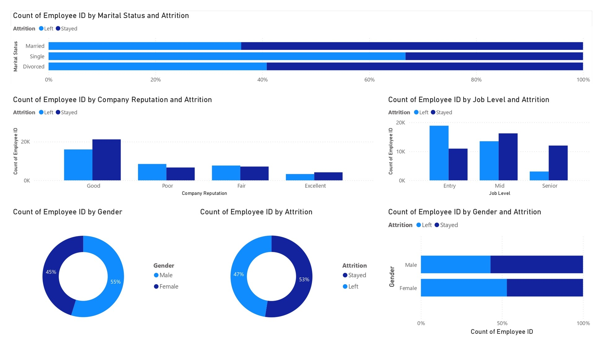
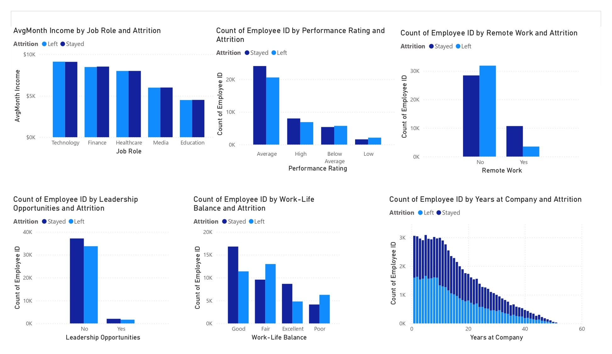
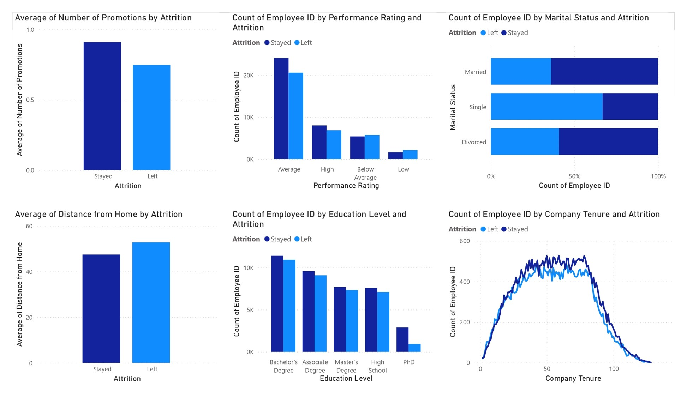
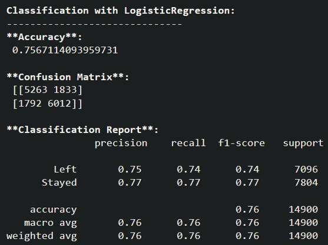
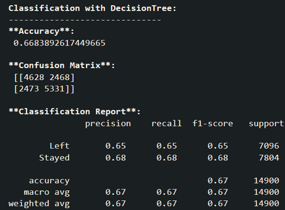
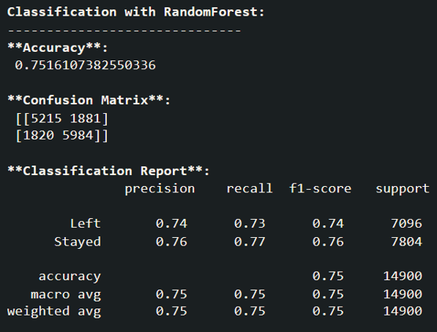
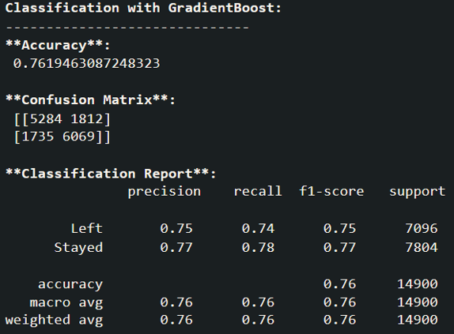

# Employee Attrition Prediction 
## Project Overview
Employees are the backbone of the organization. Organization's performance is heavily based on the quality of the employees. There are many challenges that an organization has to face due employee attrition.
Our project is to develop a machine learning model that predicts employee attrition based on historical data. the model aims to:
- **Reduced Costs**: Lowering recruitment and training expenses by retaining valuable employees.
- **Improved Morale**: Enhancing team stability and morale by minimizing disruptive turnover.
- **Strategic Planning**: Enabling HR departments to design targeted retention strategies and improve overall organizational performance.

## Table of Contents

- [Project Overview](#project-overview)
- [Dataset](#dataset)
- [Exploratory Data Analysis (EDA)](#exploratory-data-analysis-eda)
- [Modeling](#modeling)
- [Results](#results)
- [Conclusion](#conclusion)
- [Acknowledgements](#acknowledgements)

## Dataset
Employee Attrition Dataset contains detailed information about various aspects of an employee's profile, including demographics, job-related features, and personal circumstances.
The dataset comprises 74,498 samples, Each record includes a unique Employee ID and features that influence employee attrition.
The goal is to understand the factors contributing to attrition and develop predictive models to identify at-risk employees.

### Features

- **Employee ID**: A unique identifier assigned to each employee.
- **Age**: The age of the employee, ranging from 18 to 60 years.
- **Gender**: The gender of the employee
- **Years at Company**: The number of years the employee has been working at the company.
- **Monthly Income**: The monthly salary of the employee, in dollars.
- **Job Role**: The department or role the employee works in, encoded into categories such as Finance, Healthcare, Technology, Education, and Media.
- **Work-Life Balance**: The employee's perceived balance between work and personal life, (Poor, Below Average, Good, Excellent)
- **Job Satisfaction**: The employee's satisfaction with their job: (Very Low, Low, Medium, High)
- **Performance Rating**: The employee's performance rating: (Low, Below Average, Average, High)
- **Number of Promotions**: The total number of promotions the employee has received.
- **Distance from Home**: The distance between the employee's home and workplace, in miles.
- **Education Level**: The highest education level attained by the employee: (High School, Associate Degree, Bachelor’s Degree, Master’s Degree, PhD)
- **Marital Status**: The marital status of the employee: (Divorced, Married, Single)
- **Job Level**: The job level of the employee: (Entry, Mid, Senior)
- **Company Size**: The size of the company the employee works for: (Small,Medium,Large)
- **Company Tenure**: The total number of years the employee has been working in the industry.
- **Remote Work**: Whether the employee works remotely: (Yes or No)
- **Leadership Opportunities**: Whether the employee has leadership opportunities: (Yes or No)
- **Innovation Opportunities**: Whether the employee has opportunities for innovation: (Yes or No)
- **Company Reputation**: The employee's perception of the company's reputation: (Very Poor, Poor,Good, Excellent)
- **Employee Recognition**: The level of recognition the employee receives:(Very Low, Low, Medium, High)

- **Attrition**: Whether the employee has left the company, encoded as 0 (stayed) and 1 (Left).

## Exploratory Data Analysis (EDA)
The EDA phase involves visualizing and analyzing the data to identify patterns and relationships between features. 

Visualizations were created using `Power BI`

## Modeling
Logistic Regression, Decision Tree, Random Forest and Gradient Boost models are trained to predict Employee Attrition based on key features.

The model's performance was evaluated using:

- **Accuracy**: Percentage of correct predictions.
- **Confusion Matrix**: To visualize the performance of the classification.
- **Precision, Recall, and F1-Score**: For a more detailed analysis of model performance.

## Results

The Gradient Boost model is the best.

## Conclusion
This project demonstrates how exploratory data analysis and machine learning can be applied to historical datasets to derive insights and make predictions. While The Gradient Boost model provided good predictions, further improvement could be achieved by exploring more sophisticated models or additional feature engineering.

## Acknowledgements
- The dataset is provided by [Kaggle](https://www.kaggle.com/datasets/stealthtechnologies/employee-attrition-dataset/data?select=test.csv).
- Inspiration from various public notebooks and tutorials on Kaggle.
